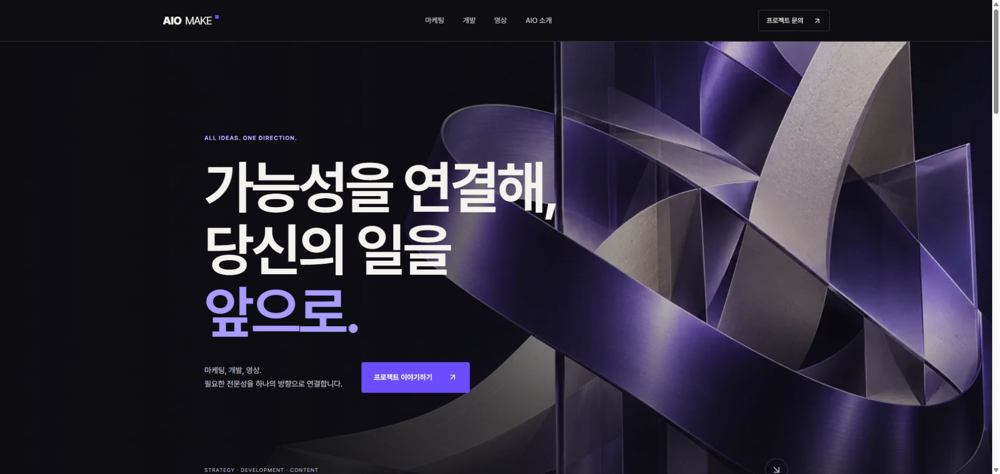
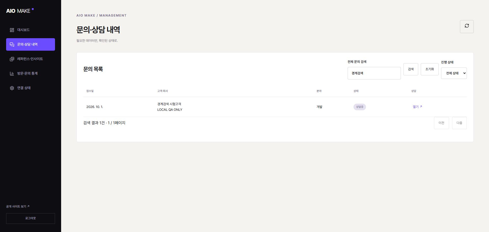
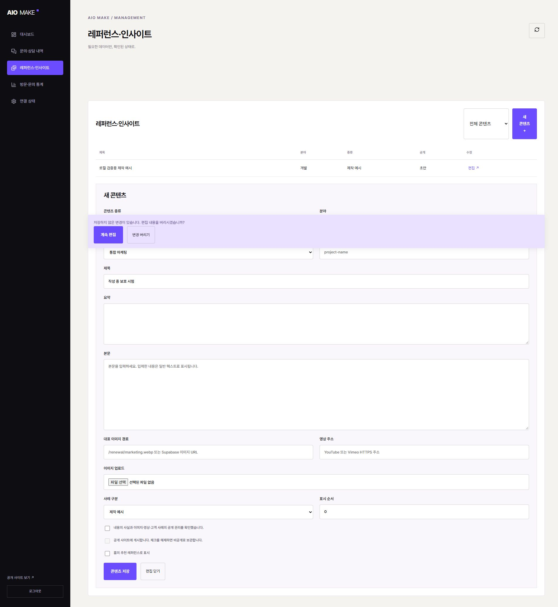
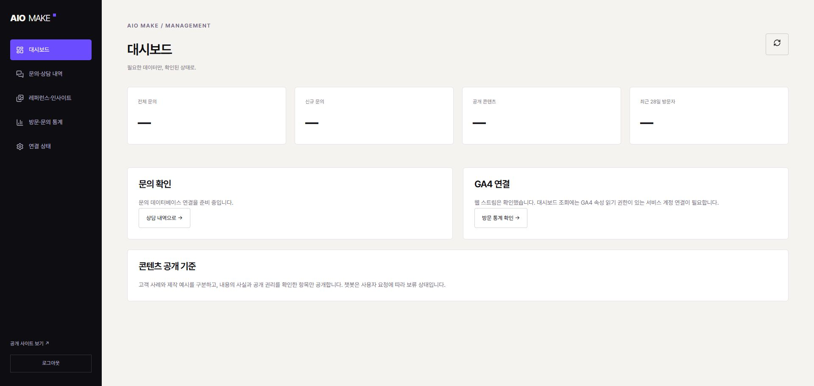

# AIO MAKE 실제 사용·수정·재검증 v02

2026-10-01 KST · WRK-20261001-WEBSITE-RENEWAL · 담당: 이 대화의 Codex

**로컬 리뉴얼 후보를 직접 조작해 문제를 재현하고 수정한 뒤 다시 검증했습니다. 운영 배포 완료를 뜻하지 않습니다.** 이전 후보 9781a21은 Git에 보존됩니다. 이 기록은 담당 AI의 자기 점검이며 다른 AI의 독립 검토가 아닙니다.

## 동선별 최종 상태

|순서|사용 동선|상태와 실제 확인|
|---|---|---|
|1|홈에서 세 분야 확인|로컬 양호. 브랜드·분야·문의 동선을 확인. 기존 홈 이미지를 유지하고 추가 폭 시험에서 가로 넘침 없음|
|2|분야 → 서비스 상세 → 문의|로컬 양호. 쇼핑몰 생성 제품 이미지 적용, 테마 전환 aria-pressed=true와 장바구니 1개 확인. 문의 서비스가 쇼핑몰로 선택됨|
|3|문의 작성 → 오류 → 접수|로컬 양호. 연락처 미입력시 이메일 포커스/aria-invalid=true. 실제 로컬 PostgreSQL 저장 후 접수번호와 성공 제목 포커스 확인|
|4|로그인 → 대시보드|로컬 양호. 실제 로그인 폼 및 HTTP 인증 검사. 시험 DB 연결을 제거한 최종 대시보드 수치는 모두 ‘—’이며 연결 대기|
|5|문의 검색 → 상세 → 상담 저장|로컬 양호. 최초 50건 밖에 있는 문의가 검색됨. 상태 변경과 메모 저장·재조회. 사람이 읽을 수 있는 서비스명과 상세 제목 포커스|
|6|콘텐츠 작성 → 보호 → 저장 → 공개 페이지|로컬 양호. 작성 중 닫기 → 계속 편집시 입력 유지. 이미지 미리보기, 저장된 slug 링크, 실제 공개 페이지. API/SQL 공개·비공개 검사|
|7|방문·문의 통계|연결 대기. GA4 웹 스트림 확인과 서버 Data API 인증은 별개. 임의 방문자·전환 수치를 표시하지 않음. 챗봇 HOLD 유지|

## 발견 → 수정 → 재검증

|발견 근거|변경|재검증|
|공개 페이지 제목이 컨테이너 왼쪽에 붙음|page-intro의 padding을 padding-block으로 바꿔 좌우 여백 보존|문의·회사·콘텐츠 상세와 4폭 확인|
|문의 필수 표시가 별도 행에 배치됨|필드 제목과 별표를 하나의 요소에 묶음|실제 화면 확인, 입력 이름은 별표 없이 접근 가능|
|연락처 없는 문의 오류가 폼 맨 아래에만 표시됨|서버와 같은 스키마로 사전 검사, 오류 필드 포커스·설명 연결, 성공 제목 포커스|이메일 focus/aria-invalid와 접수 성공을 실제 조작으로 확인|
|기호만 있는 전화번호가 통과할 수 있음. 긴/비정상 유입값이 정상 문의를 막을 수 있음|전화 숫자 길이·형식 검사. 유입값 길이·타입과 세션 ID 정규화|단위·HTTP 전화번호 거부 검사. 유입값은 코드 점검 범위이며 별도 브라우저 손상 저장소 시험은 미실행|
|모바일 메뉴 Escape가 닫히지 않고 분야 문의 경로가 일관되지 않음|Escape 닫기·버튼 포커스 복귀, 현재 분야 문의 URL|실제 메뉴 열기와 Escape 후 aria-expanded=false, 분야 문의 경로 확인|
|61건 중 다음 페이지의 고객을 검색해도 결과 없음|전체 DB에서 검색·상태 조건을 적용한 뒤 페이지 나눔. 이전 요청 취소|61건 재현 → 검색 1건. 추가 HTTP에서 또 61개 합성 자료로 첫 50건 밖 검색·상태 결합·literal % 검사|
|상담 상세가 목록 아래에 열려 이동이 모호하고 서비스 slug가 노출됨|상세 제목 포커스와 열기 버튼 상태, 표시용 서비스명|화면에서 상세 열기 → 상담 메모/상태 저장 확인|
|대표 이미지에 YouTube나 다른 Supabase 호스트도 허용되는 코드 불일치|이미지 전용 허용 경로, 미리보기·잘못된 주소 안내, 공개 렌더링 방어|실제 폼에서 잘못된 주소 저장 거부. 단위·HTTP 400. 잘못된 기존 cover를 가진 로컬 DB 자료도 공개 페이지 200|
|편집 닫기시 입력 유실, 미저장 slug를 공개 페이지 링크에 사용|화면 안의 계속 편집/변경 버리기, 페이지 이탈 경고. 공개 링크는 저장된 자료 기준|계속 편집 후 제목 유지. 미저장 unsaved-slug 입력 중에도 /lab/work/loop-polished-example 링크 유지|
|관리자 새 콘텐츠 버튼이 좁게 줄바꿈됨|도구 영역 폭·flex 정리, 빈 목록 안내|PC와 375px 편집 화면 확인|
|쇼핑몰 제작 예시에 가짜 CSS 제품 모양만 있음|머그·조명·화병 제품 장면을 직접 생성하고 WebP 적용|원본/프롬프트/해시 보존. 테마와 장바구니 동작 확인. 실제 고객 상품으로 표시하지 않음|

## 실행 결과와 범위

- typecheck, lint 오류/경고 0, production build PASS. 같은 폴더의 .log 참고.
- 단위·실제 PGlite PostgreSQL 9개 PASS. 기존 SQL 시험에 전역 검색·페이지 경계·상태 조건·함수 권한 검사를 추가했습니다.
- 기존 HTTP 통합 9동선 PASS. 추가 http-usability.json의 8회귀 동선 PASS. 실제 Next API + 루프백 REST 어댑터 + PGlite이며 운영 Supabase 시험이 아닙니다.
- responsive-after.json: 공개 화면 6종 × 320/375/768/1440px = 24개 추가 기록에서 document clientWidth=scrollWidth. 이 값은 전체 WCAG 적합성이나 실제 스마트폰 검증을 뜻하지 않습니다. lazy 이미지 전체가 로드되었다는 보장도 아닙니다.
- 관리자 375px 편집에서 width=scrollWidth=375 확인. 표는 컨테이너 내부 가로 스크롤로 접근합니다.
- 시험 자료는 합성 자료만 사용했고 시험 어댑터를 종료했습니다. ignored .env.local은 시험 전 상태로 복구했습니다. 운영 데이터·권한·계정·배포를 변경하지 않았습니다.
- build는 DB 연결 없는 최종 환경에서 실행했습니다. 운영 Storage 업로드 성공, GA runReport/DebugView, Vercel preview/live, 실기기, CWV는 아직 미검증입니다.

## 화면 근거

아래 이미지는 저장 후 실제 파일을 열어 확인한 화면만 최종 근거로 사용합니다.

1. 홈 — 01-home-after.png: 최종 공개 홈.
2. 문의 검색 — 13-search-final.png: 페이지 밖 고객이 검색된 실제 로컬 합성 자료.
3. 콘텐츠 편집 — 12-editor-final.png, 16-admin-mobile-after.png: 대표 이미지와 저장된 주소, PC/모바일 편집.
4. 내용 보호 — 15-unsaved-after.png: 화면 안의 계속 편집/변경 버리기.
5. 최종 대시보드 — 09-dashboard-final.png: 시험 연결 제거 후 수치 ‘—’.

### 제외한 관측

초기 로딩 또는 프레임 갱신 중 캡처에는 이전 화면·틀어진 배율이 섞였습니다. 11-inquiry-detail-before.png, 13-search-after.png, 04-contact-final.png, 05-contact-error-final.png, 07-receipt-final.png는 해당 동선의 최종 시각 증거로 사용하지 않습니다. 접수·오류·포커스 결과는 실제 DOM/HTTP 기록으로 확인했으며, 프레임이 이전 상태를 보여주는 이미지를 성공 근거로 삼지 않았습니다. 불완전 캡처와 이전 화면은 감사 기록으로 보존합니다.

IAB의 기본 확인창에서 조작 도구가 막혀 동일한 로컬 사이트를 Chrome으로 이어서 검증했습니다. 기본 confirm 대신 화면 내 확인을 구현하고 계속 편집을 실제 검증했습니다. 일부 full-page 캡처는 시간 초과였으므로 없는 화면을 확인했다고 기록하지 않았습니다.

## 운영 전환에 남은 일

Supabase INACTIVE 복구/백업·실제 스키마/Storage 정책 대조, Vercel 인증·실제 배포 연결, GA4 읽기 인증과 원본 수치 대조, 기존 ERP/cron/API 및 portfolio 주소 이전, 개인정보 운영 조건 확정. RELEASE.md의 대상과 검증·롤백 절차를 따릅니다. 이번 반복 검증만으로 무결점·운영 완료를 보장하지 않습니다.
